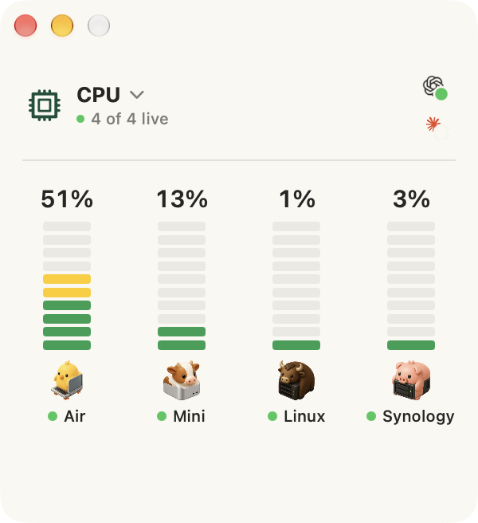

# Little Herd

Little Herd is a compact, native macOS system monitor for a configurable group
of Macs, Linux computers, GPU workstations, and mounted network storage. A new
install begins with the current Mac and can discover or manually add several
machines at once.



The project, target, module, bundle identifier, preferences, helper, and state
paths all use the Little Herd name. Builds that used the former internal name
automatically migrate their saved machine configuration on first launch.

## Herdware avatars

The interface gives each machine a compact isometric animal-and-computer
identity. The shipping suite covers laptop, mini desktop, compact workstation,
all-in-one, NUC, edge AI box, NAS, tower, multi-GPU workstation, rack server,
coordinator, and cloud/remote roles. Little Herd infers a sensible avatar during
discovery and lets the user review it before adding the machine.

## Adding machines

**File → Add Machines…** (`⌘N`) browses the local network for Bonjour SSH and
SMB services. Already-configured machines are hidden, new SSH computers are
selected by default, and several can be added with one action. A manual path
accepts any SSH hostname or alias when a machine does not advertise Bonjour.
Storage discovered before network-volume permission is saved as a deferred
machine so it can finish connecting after the permission flow.

Machine names, hostnames, platforms, connection types, avatars, optional SSH
identity-file paths, and SMB aliases are encoded in the app's
`machineConfigurationsV1` preference. The monitor and Add Machines window share
this one configuration store; there is no second hard-coded machine list.

- The current Mac is sampled with native macOS APIs.
- Remote Macs and Linux computers are sampled over SSH every ten seconds.
- Network storage appears only in Disk and reads capacity from mounted SMB
  shares. Finder and Keychain continue to own the SMB login.

Remote machines need only their built-in system tools and SSH access; no
companion agent, daemon, password, or elevated privilege is required.
Little Herd stores only the configured SSH host and optional identity-file
path; private keys remain in the user's SSH configuration. It uses SSH
connection sharing so it does not repeatedly perform a full handshake.

The **CPU** overview shrinks to a compact window and shows the three computers
together as vertical, segmented thermometers. Green, yellow, orange, and red
blocks communicate increasing CPU load; they do not represent hardware
temperature. Each machine icon and name sits below its thermometer with a green
status dot when live and a red dot when unreachable. CPU percentages above 99%
also turn red. The window contains no tabs or navigation controls. The macOS
**View** menu uses **⌘1–⌘4** for CPU, memory, disk, and AI across all machines.
Configured machines appear dynamically in the **View** menu.
The overview header menu also switches between those same four views
while leaving the Codex and Claude allowance visible. The selected icon sits in
the center; clicking either outer icon rotates it into place, animates the
header, and dissolves the main thermometers into the selected metric. Disk
overview uses the same one-bar-per-machine language as the others, showing each
machine's fullest volume — the one that runs out first — with its free space
beneath; the per-volume breakdown lives in that machine's page. Attached drives
are included, while virtual and hidden system volumes are excluded, as are
mounted disk images, which are read-only and report a capacity that can never
change. The normal
header shows the overview's connection status plus the remaining Codex and
Claude allowance reported by CodexBar.
Little Herd reads CodexBar's existing local summary caches once per minute; it
does not make additional usage-service requests or read authentication
credentials. Each allowance pairs the provider's app icon with a small circular
remaining-budget gauge; hovering reveals the provider names and **left** labels
without moving the surrounding header. The gauge turns orange at 25% remaining,
red at 10%, and adds a pulsing red halo at 1% or less. In that urgent state the
icon opens the provider's usage and billing page so credits or auto-top-up can
be managed. Clicking a machine's bar opens that machine seen through the current metric, and
clicking its icon opens every metric for that machine. The bar you clicked
travels out of the overview and grows, so the thing you touched is the thing you
are looking at; the chevron, the machine name, and the enlarged bar or icon all
go back. The metric picker stays available on a machine's page, so switching
from CPU to RAM re-lenses the machine you are already looking at rather than
returning you to the overview.

A machine's CPU page lists what is running and its approximate CPU-core usage,
skipping anything too small to round to a tenth of a core. Memory overview uses the operating system's normal, warning,
and critical pressure state—shown as check, warning, and critical symbols—instead
of treating intentionally occupied cache as a problem. Its memory page lists that machine's largest user-app families with their
approximate resident memory and their own application icons, making likely apps
to quit immediately visible. App names are the only bold text in these compact
details; memory amounts use the same small, secondary treatment as the overview
status line. Little Herd keeps a tiny rolling history of those existing samples. After at least 90 seconds and seven distinct readings, a red dot marks
an app whose memory has grown substantially and consistently. Hovering the dot
shows the measured growth, duration, and rising-sample count. This is labeled as
a possible leak because trend sampling cannot prove that allocations are
unreachable.
Its storage page lists each volume with free space, total capacity, and a fill
bar. Volumes sharing one APFS container are reported as a single row, because
they share a free-space pool and listing them separately would count the same
free space several times; such a row says how many volumes it covers, since its
figures describe the container rather than the volume it is named after. Codex and Claude activity rows show the project they are
working in, with provider-colored sparkle icons for AI tasks and
operating-system work labelled **CPU**. Little Herd reads only the newest
session metadata every 30 seconds and does not retain raw transcripts. Active
agent tasks take priority over
background CPU rows; remaining slots show the heaviest processes. Remote titles
use the existing encrypted SSH connection. Compile and build activity includes
the project name when it can be inferred safely from that process's working
folder. Terminal multiplexers retain their app name and may identify a direct
child such as an SSH session.

The **AI** view shows all agents Little Herd currently identifies as active, plus
the six most recent waiting or finished agents across configured machines.
Codex rows use the ChatGPT app icon and Claude rows use the Claude Code app icon.
A green dot means active, a blue dot means finished, and an orange clock means
waiting for more work or output. Hovering a row replaces the stable header with
that agent's machine, project, state, and latest structured plan step. When the
agent has published a plan, a small circular indicator shows both its completed
fraction and the current step number (for example, **4/4**). Agents that do not
publish structured plan data remain visible without an invented percentage.
The probe runs at most every 30 seconds, reads only bounded tails of recent
session files, and never sends prompts, responses, command lines, or credentials
over the network.

## Task handoffs

While the CPU overview is visible, an active AI-task transfer temporarily
replaces it with the physical handoff treatment: the source recedes, the
destination lights up, and the task capsule follows a curved route between
machines. The one-time entrance animation settles immediately, so an extended
handoff does not keep redrawing effects in the background. **Reduce Motion** is
respected.

Little Herd polls `~/.local/state/little-herd/transfer.json` every two seconds.
The file contains only a task ID, short display title, provider, source,
destination, approximate CPU-core usage, timestamps, and status. It contains no
SSH credentials, API keys, prompts, responses, command lines, or transcripts.
The app reads this file; it does not dispatch or move tasks itself.

The included helper writes the record atomically with mode `0600`:

```sh
scripts/little-herd-transfer start codex "Chromium AX review" source-id destination-id 0.8
scripts/little-herd-transfer arrive
scripts/little-herd-transfer fail
scripts/little-herd-transfer clear
```

`start` displays the handoff for up to ten minutes. `arrive` and `fail` show the
completion state briefly before Little Herd returns to its stable CPU overview.
Agent wrappers can call these same commands when they actually dispatch and
confirm a task on another machine.

## Metrics

The current Mac shows CPU, GPU, memory, network, and disk usage using native
macOS system APIs. Remote Macs, Linux, and Synology show CPU, memory, network,
and disk usage; their GPU row intentionally says **Local only**.

Remote collection runs one short, read-only SSH command per machine per sample.
If a machine is asleep or unreachable, its last values remain visible and the
header changes to **Unavailable**. Monitoring reconnects automatically.
Activity collection uses process names, CPU percentages, direct parent/child
process relationships, and—for active build tools only—the process working
folder. It does not inspect command arguments, prompts, responses, environment
variables, or credentials. The same existing process-list sample is reused for
memory attribution, so the memory page adds no additional periodic process scan.
Helper processes are grouped under their containing app before the largest app
families are shown, and each is labelled with its own application icon, read
from the bundle the process was launched from.

## Build

Requires macOS 15 or later, Xcode, and
[XcodeGen](https://github.com/yonaskolb/XcodeGen).

```sh
xcodegen generate
xcodebuild -project LittleHerd.xcodeproj -scheme LittleHerd -configuration Debug build
xcodebuild -project LittleHerd.xcodeproj -scheme LittleHerd test
```

## License

Little Herd is source-available under the [Functional Source License 1.1 with an
MIT future license](LICENSE.md) (`FSL-1.1-MIT`).

Use it, modify it, and build on it freely for any purpose except making a
competing commercial product. Two years after each release ships, that release
becomes available under the MIT license.

Bundled third-party code and its terms are listed in
[THIRD-PARTY-LICENSES.md](THIRD-PARTY-LICENSES.md).
